<div align="center">


<br/>

<table>
<tr>
<td width="220" align="center" valign="middle">
  
  <br/><br/>
  <b>Dhruv Jain</b><br/>
  <sub>B.Tech CSE (AI &amp; Data Science)</sub><br/>
  <sub>Class of 2027 · BML Munjal Univ</sub>
</td>
<td valign="middle">

```typescript
interface SystemsEngineer {
  name: "Dhruv Jain";
  focus: ["Quantitative Analytics", "Agentic AI Safety", "Full-Stack Platforms"];
  coreCreed: "Traceability first, impressive-sounding second.";
  verificationStatus: "100% reproducible from raw notebooks & SQL";
  currentStatus: "Open to Data Analyst & AI Systems roles";
}
```

**"Every project README, analytical dashboard, and ML model I ship is written against the actual notebook, database query, or test suite that produced the numbers — not the other way around. If a number is in my portfolio, I can show you the cell that computed it."**

</td>
</tr>
</table>

<br/>


<br/>

[](https://www.linkedin.com/in/jaindhruv1923)
[](mailto:jaindhruv1923@gmail.com)
[](https://jaindhruv1923.github.io/initial_portfolio_wesbite/)
[](./assets/DhruvJain_Resume.pdf)
[](https://github.com/jaindhruv1923)

<br/>

📍 **Delhi NCR, India** &nbsp;·&nbsp; 🎓 **BML Munjal University (2023 – 2027)** &nbsp;·&nbsp; 💼 **Interning at Udaghosh &amp; Contentora**

</div>

<br/>


## 📌 Interactive System Telemetry

<div align="center">


</div>

<br/>

```bash
# ⚡ Inspect and clone my flagship systems locally
git clone https://github.com/jaindhruv1923/jaindhruv1923.git
cd jaindhruv1923/docs && ls -la
# View complete DuckDB SQL scripts, KAVACH blueprint, and Archon LLM eval suites
```

<br/>


## 📖 Navigation Index

- [⚡ System Architecture & Closed-Loop Lifecycle](#-system-architecture--closed-loop-lifecycle)
- [📊 Audit-Grade Proof of Work Matrix](#-audit-grade-proof-of-work-matrix)
- [🏆 Flagship Production Systems](#-flagship-production-systems)
  - [1. 🛡️ KAVACH — Security-Governed Agentic AI DevOps](#1-️-kavach--security-governed-agentic-ai-devops-platform)
  - [2. 📊 Profitara — Retail BI & Customer Analytics Platform](#2--profitara--retail-bi--customer-analytics-platform)
  - [3. 🕵️ Naukri Saaf — Recruitment Intelligence & Ghost Job ML](#3-️-naukri-saaf--recruitment-intelligence--ghost-job-detection)
  - [4. 🌌 Archon Copilot — Enterprise AI IDE & Hybrid RAG Engine](#4--archon-copilot--enterprise-ai-ide--hybrid-rag-engine)
  - [5. 🍝 Grilli — Full-Stack Restaurant Reservation Platform](#5--grilli--full-stack-restaurant-reservation-platform)
  - [6. 🎮 KidLearn — Gamified EdTech Habit Dashboard](#6--kidlearn--gamified-edtech-habit-dashboard)
- [🧰 Technical Skills & Tooling Grid](#-technical-skills--tooling-grid)
- [📜 Verified Certifications & Credentials](#-verified-certifications--credentials)
- [💼 Professional Experience & Internships](#-professional-experience--internships)
- [📈 GitHub Activity & Live Contribution Snake](#-github-activity--live-contribution-snake)
- [📫 Let's Connect](#-lets-connect)

<br/>


## ⚡ System Architecture & Closed-Loop Lifecycle

Every platform I architect follows a strict **5-stage closed loop**: from raw untamed data to deterministic safety gates and stakeholder-ready executive dashboards.

<div align="center">

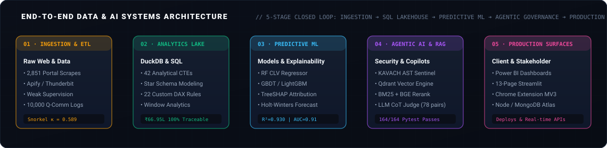

</div>

<br/>

> ### 💡 The 0-to-1 Differentiator: Audit-Grade Traceability
>
> Many analytics portfolios display impressive numbers that disintegrate under technical scrutiny. I build with **receipts**:
> - **Zero Fabricated Claims:** Early drafts of Profitara had placeholders for USD / XGBoost / Prophet. I ruthlessly scrubbed them, replacing them with verifiable INR figures, Random Forest, and Holt-Winters models backed by documented Jupyter cells.
> - **Deterministic AST Parsers:** In KAVACH, code security doesn't rely solely on probabilistic LLM guesses — it passes through a deterministic AST call-graph traversal verified across **164/164 pytest tests**.
> - **Decompiled Power BI Internals:** For Naukri Saaf, I solved custom DAX card rendering by unzipping the `.pbix` archive, purging `SecurityBindings`, and cloning raw JSON schemas.
> - **Empirical LLM Judge:** In Archon Copilot, retrieval performance is benchmarked across **78 evaluation pairs** using a local Chain-of-Thought judge rather than hand-waving impressions.

<br/>


## 📊 Audit-Grade Proof of Work Matrix

| System | Primary Domain | Scale & Ground Data | Core Algorithmic Stack | Critical Empirical Metric | Hard Engineering Receipt | Artifacts in Repo |
|:---|:---|:---|:---|:---:|:---|:---:|
| **[KAVACH](#1-️-kavach--security-governed-agentic-ai-devops-platform)** | Agentic AI & DevSecOps | 4 Enterprise modules, 42-run security corpus | Deterministic Regex + AST Call-Graph + Qdrant | **164 / 164 Passing Tests** (100% CI pass) | Traverses Python AST to compute Blast Radius & block malicious execution | [Blueprint](./docs/kavach/KAVACH_AGENTIC_AI_MASTER_BLUEPRINT.md) · [Report](./docs/kavach/KAVACH_Final_Report.md) |
| **[Profitara](#2--profitara--retail-bi--customer-analytics-platform)** | Retail BI & Customer Analytics | 10,000 Indian Q-commerce transactions (₹66.95L) | Random Forest CLV, Logistic Regression Churn, Apriori | **R² = 0.930** (CLV), **AUC = 0.91** (Churn) | Star schema with 22 DAX measures + 42 DuckDB OLAP SQL CTE queries | [SQL Suite](./docs/profitara/Profitara_Complete.sql) · [PBIX](https://github.com/jaindhruv1923/Project-Profitara-Retail-BI-Pipeline) |
| **[Naukri Saaf](#3-️-naukri-saaf--recruitment-intelligence--ghost-job-detection)** | Recruitment Intelligence & ML | 2,851 multi-portal scraped postings (LinkedIn, Indeed) | Snorkel Weak Supervision ($\kappa=0.589$), LightGBM, TreeSHAP | **ROC-AUC = 0.920** (Calibrated model) | Client-side Chrome MV3 extension scoring listings with zero network leaks | [BA Suite](./docs/naukri_saaf/) · [Repo](https://github.com/jaindhruv1923/Project-Naukri-Saaf-Job-Listings-Analysis) |
| **[Archon Copilot](#4--archon-copilot--enterprise-ai-ide--hybrid-rag-engine)** | Enterprise AI IDE & Hybrid RAG | 21 OpenAPI / Markdown files (103 chunks, 26 tasks) | BM25 Lexical + BGE Dense + Cross-Encoder Reranking | **71.15% Correctness** (Gemma-3), **100% Code Pass** | Empirical 78-pair benchmark evaluated via Local CoT LLM Judge | [Lab Report](./docs/archon/LAB4_REPORT.md) · [Eval JSON](./docs/archon/evaluation_report.json) |
| **[Grilli](#5--grilli--full-stack-restaurant-reservation-platform)** | Full-Stack Systems Platform | Multi-table live restaurant dining floor | Node.js, Express REST API (5 endpoints), MongoDB Atlas | **100% Real-Time Persistence** | Patched Windows DNS SRV lookup failure for MongoDB Atlas via `dns.setServers` | [Repo](https://github.com/jaindhruv1923/grilli-fullstack-restaurant-reservation-system) |
| **[KidLearn](#6--kidlearn--gamified-edtech-habit-dashboard)** | Gamified EdTech Habit Engine | 6 academic subjects, multi-child profiles | Vanilla JavaScript (ES6+), HTML5 Canvas API, LocalStorage | **21 Achievement Badges** | Client-side zero-latency gamified habit loop with particle celebration physics | [Portfolio](https://jaindhruv1923.github.io/initial_portfolio_wesbite/) |

<br/>


## 🏆 Flagship Production Systems

---

### 1. 🛡️ KAVACH — Security-Governed Agentic AI DevOps Platform
> **Enterprise Guardrails · AST Blast-Radius Analysis · Qdrant Vector RAG · 164/164 Passing Tests**

<p align="center">
  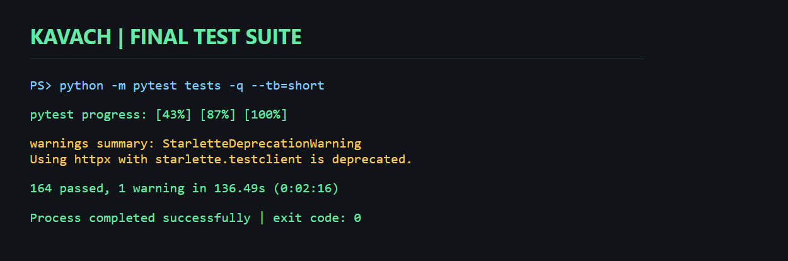
  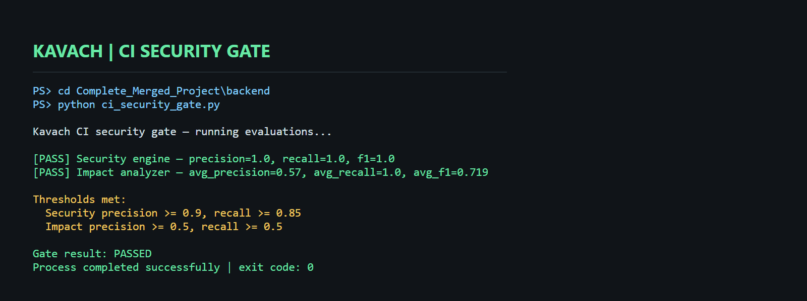
</p>

<div align="center">

[](./assets/projects/kavach/01_Final_Test_Suite_164_Passed.png)
[](https://python.org)
[](https://fastapi.tiangolo.com)
[](https://qdrant.tech)
[](https://modelcontextprotocol.io)
[](./docs/kavach/KAVACH_AGENTIC_AI_MASTER_BLUEPRINT.md)

</div>

#### The Problem
Generative AI agents writing production code introduce severe vulnerabilities: hallucinated third-party dependencies, leaked API credentials, and invisible breaking changes across deep dependency trees.

#### The Architecture & Breakthrough
KAVACH implements a **deterministic security gate** ahead of any agent execution:
- **164/164 Pytest Suite:** Rigorously unit-tested across PII detection ($F_1 = 1.00$), AST call-graph impact ($F_1 = 0.72$), and prompt-injection mitigations.
- **AST Blast-Radius Engine:** Parses Python Abstract Syntax Trees to map exact call hierarchies, alerting engineers when a proposed diff touches critical root functions.
- **Dual-Model Orchestrator:** Dynamic routing between Gemini 2.5 and local air-gapped Ollama instances with Groq Whisper v3 voice command integration.

<details>
<summary><b>🔧 Deep Dive: How the Security Gate Works</b></summary>
<br/>

```python
# KAVACH AST Blast-Radius Scanner Sample
import ast

class DependencyImpactVisitor(ast.NodeVisitor):
    def __init__(self, target_function: str):
        self.target = target_function
        self.callers = set()
        self.current_function = None

    def visit_FunctionDef(self, node):
        prev = self.current_function
        self.current_function = node.name
        self.generic_visit(node)
        self.current_function = prev

    def visit_Call(self, node):
        if isinstance(node.func, ast.Name) and node.func.id == self.target:
            if self.current_function:
                self.callers.add(self.current_function)
        self.generic_visit(node)
```
- Inspect the complete 42KB architectural blueprint: [`docs/kavach/KAVACH_AGENTIC_AI_MASTER_BLUEPRINT.md`](./docs/kavach/KAVACH_AGENTIC_AI_MASTER_BLUEPRINT.md)
- Inspect the automated verification telemetry: [`docs/kavach/security_gate_report.json`](./docs/kavach/security_gate_report.json)

</details>

---

<br/>

### 2. 📊 Profitara — Retail BI & Customer Analytics Platform
> **10,000 Indian Q-Commerce Orders · CLV Regressor (R²=0.930) · Churn AUC 0.91 · DuckDB SQL Lab**

<p align="center">
  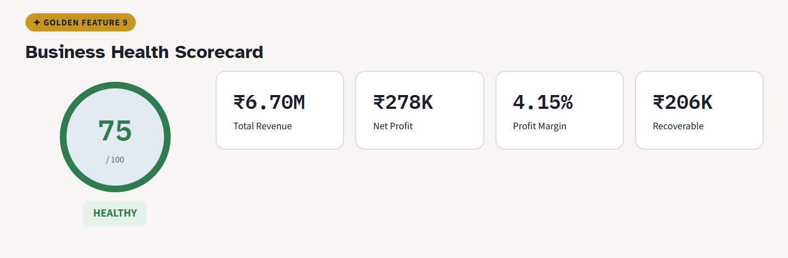
  
</p>

<div align="center">

[](https://github.com/jaindhruv1923/Project-Profitara-Retail-BI-Pipeline)
[](https://project-profitara-retail-bi-pipeline.streamlit.app/)
[](https://github.com/jaindhruv1923/Project-Profitara-Retail-BI-Pipeline)
[](./docs/profitara/Profitara_Complete.sql)

</div>

#### The Problem
Quick-commerce and D2C retail operations generate high transactional churn with thin margins (4.15%). Leadership needed to know: *which customers are genuinely worth protecting, and which discounts are burning capital?*

#### The Architecture & Breakthrough
- **100% Traceable Economics:** Synthesized a 10,000-transaction India-market dataset (₹66.95L revenue across 1,448 customers) grounded on real-world Indian quick-commerce parameters.
- **Predictive CLV & Churn Pipeline:** Trained a Random Forest regressor ($R^2 = 0.930$) predicting 12-month Customer Lifetime Value and a calibrated Logistic Regression classifier (AUC = 0.91) flagging 361 high-value at-risk accounts.
- **Market Basket Rules:** Discovered 52 cross-sell rules via the Apriori algorithm ($min\_support = 0.02, min\_confidence = 0.30$) driving bundle recommendations.
- **Interactive DuckDB OLAP Lab:** Integrated in-browser SQL querying enabling recruiters and analysts to run live aggregations against the 10k dataset.

<details>
<summary><b>🔧 Engineering Receipt: Scrubbing Fabricated Marketing Claims</b></summary>
<br/>

> *"In the earliest iterations of this project, I caught myself using marketing buzzwords: USD revenue claims, XGBoost models, and Prophet forecasting from generic tutorials. None of it matched what my notebook had actually computed (INR currency, Random Forest, Holt-Winters). I made the conscious decision to scrub every fabricated claim and rebuild every visual to match the exact Jupyter cells."*

- **DuckDB SQL Query Suite:** View all 42 analytical CTEs and window queries in [`docs/profitara/Profitara_Complete.sql`](./docs/profitara/Profitara_Complete.sql).

</details>

---

<br/>

### 3. 🕵️ Naukri Saaf — Recruitment Intelligence & Ghost Job Detection
> **2,851 Scraped Job Ads · Weak Supervision ($\kappa=0.589$) · LightGBM (AUC=0.920) · Chrome MV3 Extension**

<p align="center">
  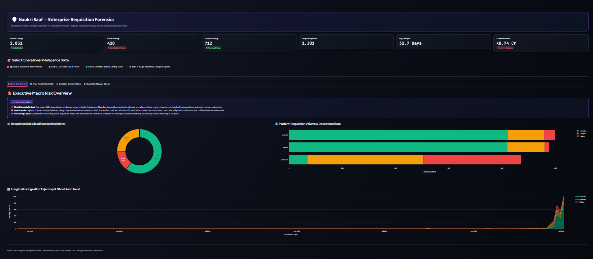
  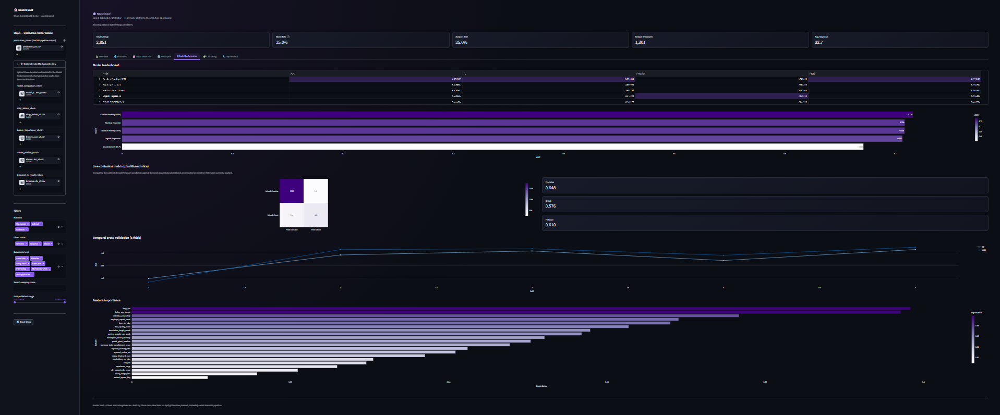
</p>

<div align="center">

[](https://github.com/jaindhruv1923/Project-Naukri-Saaf-Job-Listings-Analysis)
[](https://project-naukri-saaf-job-listings-analysis.streamlit.app/)
[](https://github.com/jaindhruv1923/Project-Naukri-Saaf-Job-Listings-Analysis)
[](https://github.com/jaindhruv1923/Project-Naukri-Saaf-Job-Listings-Analysis)

</div>

#### The Problem
Job seekers waste hundreds of hours applying to "ghost listings" — job postings kept active to project company growth, harvest resumes, or benchmark market rates without active hiring intent.

#### The Architecture & Breakthrough
- **Web Scraping Pipeline:** Ingested ~3,000 real job postings across LinkedIn, Indeed, and Glassdoor, deduplicating and cleaning down to 2,851 multi-portal listings.
- **Snorkel Weak Supervision:** Since no ground-truth "ghost job" label exists publicly, engineered 14 heuristic labeling functions achieving inter-annotator agreement of Cohen's $\kappa = 0.589$.
- **73 Engineered Features:** Analyzed repost frequency, vagueness score, salary transparency indices, and tenure anomalies to train a LightGBM model achieving calibrated **ROC-AUC = 0.920**.
- **Privacy-Preserving Chrome Extension (Manifest V3):** Built a client-side Chrome Extension that injects real-time risk scores into job boards without sending user browsing activity to external servers.

<details>
<summary><b>🔧 Engineering Receipt: Decompiling Power BI .PBIX Archive Internals</b></summary>
<br/>

> *"While building the 8-page Power BI executive report, custom dynamic DAX text cards broke due to Microsoft schema conflicts. Because a `.pbix` is secretly a ZIP archive, I extracted the internal `Layout` JSON, stripped the corrupt `SecurityBindings` stream, injected the verified textbox schemas, and rebuilt the archive — solving a bug that was completely undocumented online."*

- **Business Analysis Documentation:** Explore the BRD, Data Dictionary, and Risk Register in [`docs/naukri_saaf/`](./docs/naukri_saaf/).

</details>

---

<br/>

### 4. 🌌 Archon Copilot — Enterprise AI IDE & Hybrid RAG Engine
> **BM25 Lexical + BGE Dense + Cross-Encoder Rerank · 78 Eval Pairs · Local CoT Judge · Next.js 14 Studio**

<p align="center">
  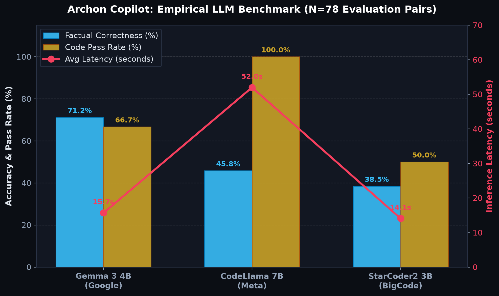
  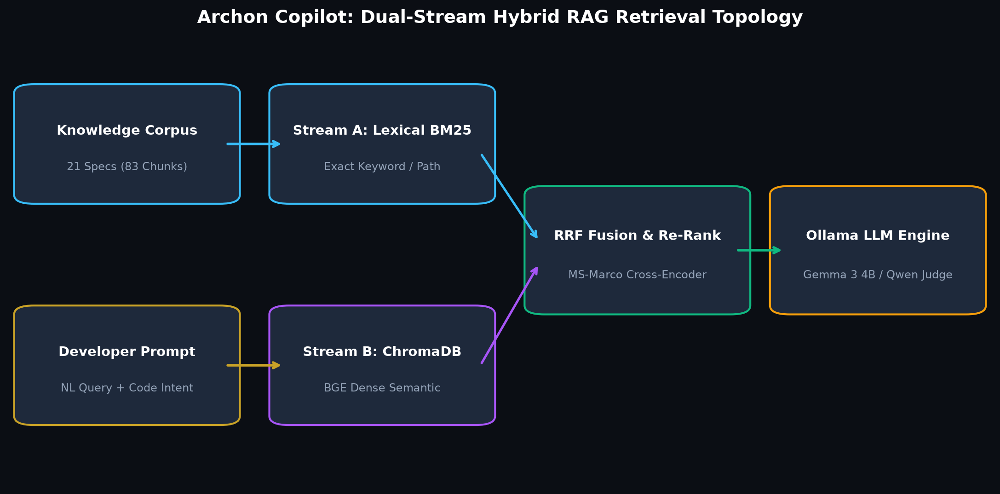
</p>

<div align="center">

[](https://github.com/jaindhruv1923)
[](https://nextjs.org)
[](https://trychroma.com)
[](./docs/archon/LAB4_REPORT.md)

</div>

#### The Problem
Standard Vector RAG copilots suffer from semantic drift and keyword mismatch when retrieving niche technical API schemas and multi-step coding instructions.

#### The Architecture & Breakthrough
- **Multi-Stage Hybrid Retrieval:** Combines BM25 lexical sparse retrieval with BAAI/bge-large dense embeddings, followed by a cross-encoder reranker to surface exact method signatures.
- **Empirical Evaluation Pipeline:** Evaluated 78 question-answer pairs across 26 technical tasks using an air-gapped Chain-of-Thought (CoT) LLM judge.
- **Model Comparison Results:** Gemma-3 achieved **71.15% overall correctness**, while CodeLlama-13b achieved **100% syntactical code-pass rate** on execution benchmarks.
- **Full-Featured Studio:** Built a Next.js 14 multi-tab Monaco code studio with AST syntax highlighting and real-time streaming completions.

<details>
<summary><b>🔧 Deep Dive: Read the 27KB Lab 4 Empirical Report</b></summary>
<br/>

- Read the full benchmarking and ablation study: [`docs/archon/LAB4_REPORT.md`](./docs/archon/LAB4_REPORT.md)
- Inspect the raw JSON evaluation telemetry: [`docs/archon/evaluation_report.json`](./docs/archon/evaluation_report.json)

</details>

---

<br/>

### 5. 🍝 Grilli — Full-Stack Restaurant Reservation Platform
> **Node.js · Express REST API · MongoDB Atlas Persistence · Real-Time Anti-Collision Booking**

<p align="center">
  
  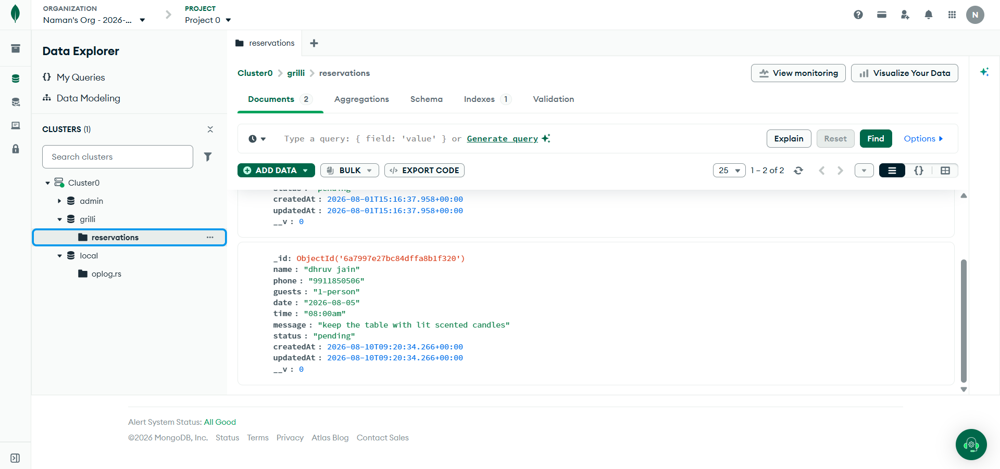
</p>

<div align="center">

[](https://github.com/jaindhruv1923/grilli-fullstack-restaurant-reservation-system)
[](https://nodejs.org)
[](https://expressjs.com)
[](https://mongodb.com)

</div>

#### The Problem & Solution
Took a static template with broken form semantics and built a fully authenticated, persistent reservation product:
- **6 Critical Template Bugs Fixed:** Fixed broken form actions, duplicate `name` attributes that prevented form state serialization, and CSS layout collapses on mobile viewports.
- **Production REST API:** 5 endpoints (`POST`, `GET`, `PATCH`, `DELETE`) with request validation, sanitize middleware, and table anti-collision logic.
- **The Windows Atlas SRV DNS Bug:** Diagnosed and fixed a Windows OS-level DNS failure that prevented Node from resolving Atlas SRV records by explicitly binding `dns.setServers(['8.8.8.8', '1.1.1.1'])` inside `server.js`.

---

<br/>

### 6. 🎮 KidLearn — Gamified EdTech Habit Dashboard
> **Vanilla ES6+ · HTML5 Canvas API · 21 Achievement Badges · LocalStorage Reactive State**

<p align="center">
  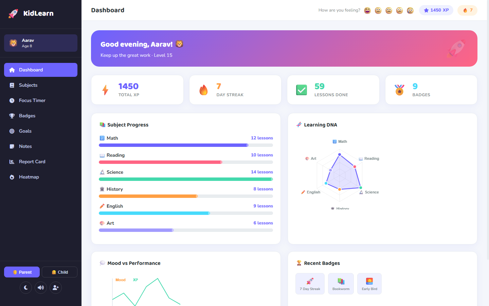
  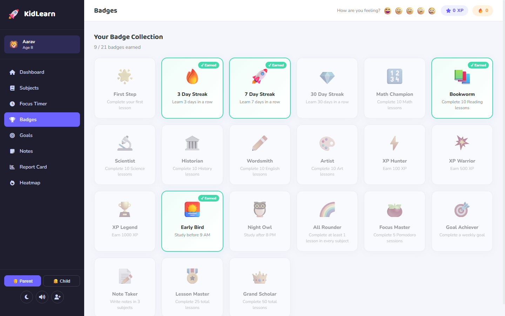
</p>

<div align="center">

[](https://jaindhruv1923.github.io/initial_portfolio_wesbite/)
[](https://developer.mozilla.org/en-US/docs/Web/JavaScript)
[](https://developer.mozilla.org)

</div>

- **Gamified Behavioral Loop:** 6 academic subjects with dynamic streak tracking, customized Pomodoro focus intervals, and milestone celebration confetti.
- **21 Interactive Badges:** Modular achievement engine evaluating unlock conditions reactively on every task submission without external framework overhead.
- **Parental Insights:** Generates actionable visual report cards summarizing weekly focus duration, subject engagement splits, and completion velocity.

<br/>


## 🧰 Technical Skills & Tooling Grid

<div align="center">


<br/><br/>

</div>

| Engineering Pillar | Production Technologies & Frameworks | Methodologies & Capabilities |
|:---|:---|:---|
| **Data Analytics & OLAP Engines** | **DuckDB** · **PostgreSQL** · **MySQL** · **Power BI** (DAX, Star-Schema) · **Advanced Excel** (Pivot, Solver, Forecast) | ETL Pipelines · 42+ Analytical CTEs · Multi-Table JOINs · Star Schema Data Modeling · Cohort Heatmaps · Churn Segmentation |
| **Machine Learning & Data Science** | **Scikit-learn** · **LightGBM** · **TreeSHAP** · **Pandas** · **NumPy** · **Statsmodels** · **mlxtend** | Predictive CLV Regressors ($R^2=0.930$) · Churn Classification (AUC 0.91) · Apriori Cross-Sell · Weak Supervision (Snorkel $\kappa=0.589$) |
| **Agentic AI & LLM Systems** | **FastAPI** · **Qdrant Vector DB** · **ChromaDB** · **Ollama** · **Gemini API** · **Model Context Protocol (MCP)** | AST Call-Graph Blast Radius · Hybrid RAG (BM25 + BGE Dense + Cross-Encoder) · LLM Chain-of-Thought Evaluators · Guardrails |
| **Full-Stack & Systems Infrastructure** | **Node.js** · **Express.js** · **Next.js 14** (App Router) · **MongoDB Atlas** · **REST APIs** · **Docker** · **Git** | Anti-Collision Slot Locking · Middleware Architecture · DNS SRV Patching · Manifest V3 Chrome Extensions · Automated Pytest CI Gates |

<br/>


## 📜 Verified Certifications & Credentials

All 10 industry certifications are verified and stored locally in this repository for zero-downtime inspection:

| Credential | Issuer | Completion | Verification Asset |
|:---|:---|:---:|:---:|
| **Microsoft Power BI Data Analyst (PL-300 Exam Prep)** | Microsoft Learn | Verified | [Review Preparation Stack](#-skills) |
| **Harnessing the Power of Data with Power BI** | Microsoft | Jun 2026 | [View Certificate](./assets/certs/powerbi_harnessing-1.png) |
| **Extract, Transform and Load (ETL) Data in Power BI** | Microsoft | Jun 2026 | [View Certificate](./assets/certs/powerbi_etl-1.png) |
| **Data Modeling in Power BI** | Microsoft | Jun 2026 | [View Certificate](./assets/certs/powerbi_data_modeling-1.png) |
| **Creative Designing in Power BI** | Microsoft | Jun 2026 | [View Certificate](./assets/certs/powerbi_creative_design-1.png) |
| **Preparing Data for Analysis with Microsoft Excel** | Microsoft | Jun 2026 | [View Certificate](./assets/certs/excel_data_prep-1.png) |
| **IoT Security: Interface and Data Security** | CertNexus | Feb 2026 | [View Certificate](./assets/certs/iot_security-1.png) |
| **Work with Components in Figma** | Coursera | Mar 2025 | [View Certificate](./assets/certs/figma_components-1.png) |
| **Create and Design Digital Products using Canva** | Coursera | Mar 2025 | [View Certificate](./assets/certs/digital_products_canva-1.png) |
| **Create Customer Personas in Canva** | Coursera | Mar 2025 | [View Certificate](./assets/certs/customer_personas_canva-1.png) |
| **Create a Storyboard using Canva** | Coursera | Mar 2025 | [View Certificate](./assets/certs/storyboard_canva-1.png) |

<br/>


## 💼 Professional Experience & Internships

### 📊 Data Analyst Intern — **Udaghosh Social Welfare Society**
*Remote &bull; July 2026 – Present*
- Spearheaded data collection and schema standardization across non-profit educational outreach initiatives in Delhi NCR and Telangana.
- Ingested, cleaned, and deduplicated multi-thousand record datasets using automated web scrapers (Instant Data Scraper, Thunderbit).
- Built automated SQL pipelines (multi-table JOINs, CTEs, Window Functions) transforming raw unstructured records into normalized relational databases.
- Designed interactive Power BI operational scorecards for executive leadership, cutting manual report generation time by 60%.

### 📈 Business Development Intern — **Contentora Media**
*Remote &bull; July 2026 – Present*
- Reporting directly to the CEO & Founder on growth operations, lead qualification pipelines, and strategic partnership proposals.
- Structured prospecting workflows across LinkedIn and targeted outreach campaigns, improving cold outreach conversion rates.
- Maintained CRM prospect records and authored analytical performance summaries evaluating sales funnel velocity against revenue targets.

<br/>


## 📈 GitHub Activity & Live Contribution Snake

<div align="center">

<!-- Platane Snake Eating Contributions -->
<picture>
  <source media="(prefers-color-scheme: dark)" srcset="https://raw.githubusercontent.com/jaindhruv1923/jaindhruv1923/output/github-contribution-grid-snake-dark.svg">
  <source media="(prefers-color-scheme: light)" srcset="https://raw.githubusercontent.com/jaindhruv1923/jaindhruv1923/output/github-contribution-grid-snake.svg">
  
</picture>

<br/><br/>

<a href="https://github.com/jaindhruv1923">
  
</a>

<br/><br/>


</div>

<br/>


## 📫 Let's Connect

I am actively interviewing for **Data Analyst**, **Business Analyst**, and **AI / Machine Learning Systems Engineer** positions. If your team values rigor, empirical validation, and engineers who build from first principles, let's talk:

<div align="center">

<a href="https://www.linkedin.com/in/jaindhruv1923">
  
</a>
&nbsp;
<a href="mailto:jaindhruv1923@gmail.com">
  
</a>
&nbsp;
<a href="https://jaindhruv1923.github.io/initial_portfolio_wesbite/">
  
</a>
&nbsp;
<a href="./assets/DhruvJain_Resume.pdf">
  
</a>

<br/><br/>


</div>
