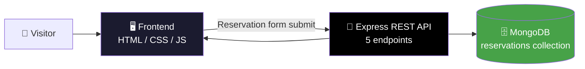

<div align="center">


<a href="#">
  
</a>

<br/>

[](https://nodejs.org/)
[](https://expressjs.com/)
[](https://www.mongodb.com/)
[](#)
[](LICENSE)

[](https://www.linkedin.com/in/jaindhruv1923)
[](mailto:jaindhruv1923@gmail.com)

**Built by [Dhruv Jain](https://github.com/jaindhruv1923)** · B.Tech CSE (AI & Data Science), BML Munjal University

</div>

<br/>

## 📖 Table of Contents

- [What this is](#-what-this-is)
- [Key results](#-key-results)
- [Screenshots](#-screenshots)
- [Architecture](#-architecture)
- [What's inside](#-whats-inside)
- [Reservation API](#-reservation-api)
- [Tech stack](#-tech-stack)
- [Quickstart](#-quickstart)
- [Repo structure](#-repo-structure)
- [Honest limitations](#-honest-limitations)
- [Roadmap](#-roadmap)
- [Connect](#-connect)

<br/>

## 🎯 What this is

> Grilli started as a **static restaurant landing page template** — good-looking
> frontend, but a reservation form that didn't actually submit anywhere and a
> handful of broken internal links. This project turns it into a **working
> full-stack product**: a real Node.js + Express REST API, a MongoDB-backed
> reservation store, and a brand-new "Our Chefs" section that didn't exist in
> the original template at all.

The goal wasn't to redesign the frontend from scratch — it was to take a
template that *looked* production-ready and make it actually behave like one:
fix what was broken, wire the form to a real backend, and add a section the
original was missing.

<br/>

## 🏆 Key results

<div align="center">

| Area | Result |
|:---|:---:|
| 🐛 **Template bugs fixed** |  |
| 🧑‍🍳 **New section built** |  |
| 🔌 **REST API** |  |
| 🗄️ **Database** |  |

</div>

<br/>

## 📸 Screenshots

**🏠 Homepage — Hero**

<p align="center"></p>
<p align="center"><i>Hero section with delightful-experience tagline and top info bar</i></p>

<br/>

**🍝 Homepage — Alternate Hero**

<p align="center"></p>
<p align="center"><i>"Where every flavor tells a story" hero slide</i></p>

<br/>

**📖 Our Story**

<p align="center"></p>
<p align="center"><i>About section — story, gallery collage, and "Since 1950" badge</i></p>

<br/>

**🍽️ We Offer Top Notch**

<p align="center"></p>
<p align="center"><i>Breakfast / Appetizers / Drinks category highlights</i></p>

<br/>

**📋 Delicious Menu**

<p align="center"></p>
<p align="center"><i>Menu preview with pricing pulled from the template's menu data</i></p>

<br/>

**🧑‍🍳 Our Chefs** — *built from scratch, not part of the original template*

<p align="center"></p>
<p align="center"><i>New "Meet the Team" section added on top of the existing design language</i></p>

<br/>

**📅 Reservation Form — Live Submission**

<p align="center"></p>
<p align="center"><i>Reservation form successfully submitting to the Express API — "Table booked successfully!" confirmation shown</i></p>

<br/>

**🗄️ Stored Reservation — MongoDB Atlas**

<p align="center"></p>
<p align="center"><i>The submitted reservation persisted as a real document in the <code>reservations</code> collection on Atlas — name, phone, guests, date, time, message, and status all saved correctly</i></p>

<br/>

**⚓ Footer**

<p align="center"></p>
<p align="center"><i>Footer with contact details, newsletter subscribe, and social links</i></p>

<br/>

## 🏗️ Architecture



<br/>

## 📦 What's inside

| Part | What it does |
|---|---|
| 🏠 **Landing page** | Menu, gallery, testimonials, about — from the original template |
| 🧑‍🍳 **Our Chefs** | New section built from scratch — not present in the original template |
| 📅 **Reservation form** | Frontend form wired to the new backend (was a dead submit handler before) |
| 🔌 **Express API** | 5 REST endpoints handling reservation create/read/update logic |
| 🗄️ **MongoDB store** | Persists every reservation submitted through the form (verified live on Atlas) |

<br/>

## 🔌 Reservation API

<details>
<summary><b>Click to expand — replace with your actual route list before publishing</b></summary>
<br/>

The backend exposes 5 REST endpoints for the reservation flow. Fill in the
exact routes from your `routes/` folder — for example:

| Method | Route | Purpose |
|---|---|---|
| `POST` | `/api/reservations` | Create a new reservation |
| `GET` | `/api/reservations` | List all reservations |
| `GET` | `/api/reservations/:id` | Get a single reservation |
| `PUT` | `/api/reservations/:id` | Update a reservation |
| `DELETE` | `/api/reservations/:id` | Cancel a reservation |

*(Update this table to match the actual routes in your codebase — don't leave
placeholder paths in the final version.)*

</details>

<br/>

## 🛠️ Tech stack

<div align="center">

| Layer | Tools |
|---|---|
| **Frontend** | HTML5 · CSS3 · JavaScript |
| **Backend** | Node.js · Express.js |
| **Database** | MongoDB Atlas |
| **API style** | REST — 5 endpoints |
| **Base template** | [Grilli by codewithsadee](https://github.com/codewithsadee/grilli) (frontend only — backend is original work) |

</div>

<br/>

## 🚀 Quickstart

```bash
# Clone the repo
git clone https://github.com/jaindhruv1923/<grilli-repo-name>.git
cd <grilli-repo-name>

# Install backend dependencies
cd backend
npm install

# Set up environment variables
cp .env.example .env
# Add your MongoDB connection string to .env

# Run the server
npm start
```

Then open the frontend in your browser (or serve it via a static file server)
and submit a test reservation to confirm it's saved in MongoDB.

<br/>

## 📁 Repo structure

```
grilli/
├── frontend/                # Static site — HTML, CSS, JS
│   ├── index.html
│   ├── assets/
│   └── ...
├── backend/                 # Express server + API routes
│   ├── server.js
│   ├── routes/
│   │   └── reservations.js
│   ├── models/
│   │   └── Reservation.js
│   └── ...
├── .env.example
├── LICENSE
└── README.md
```

*(Update this to match your actual folder layout — don't leave it generic in
the final version.)*

<br/>

## ⚠️ Honest limitations

- The reservation system does **not** send confirmation emails/SMS — it only
  persists the booking to MongoDB.
- No admin dashboard yet — reservations are stored but not visualized or
  manageable from a UI.
- No authentication — the API currently has no protection against spam
  submissions.
- Base frontend design is from the [codewithsadee Grilli template](https://github.com/codewithsadee/grilli); the "Our Chefs" section and the entire backend are original work.

<br/>

## 🗺️ Roadmap

- [ ] Add email/SMS confirmation on successful reservation
- [ ] Build a simple admin view to see/manage bookings
- [ ] Add basic rate-limiting / spam protection on the API
- [x] Fix all broken links and the dead reservation form
- [x] Build "Our Chefs" section from scratch
- [x] Build working Express + MongoDB backend

<br/>

## 📫 Connect

<div align="center">

Open to Data Analyst / Business Analyst roles and collaborations — feel free to reach out.

<a href="https://github.com/jaindhruv1923">
  
</a>
<a href="https://www.linkedin.com/in/jaindhruv1923">
  
</a>
<a href="mailto:jaindhruv1923@gmail.com">
  
</a>

</div>

<br/>

<div align="center">

**[Dhruv Jain](https://github.com/jaindhruv1923)** · [LinkedIn](https://www.linkedin.com/in/jaindhruv1923) · [jaindhruv1923@gmail.com](mailto:jaindhruv1923@gmail.com)


</div>
